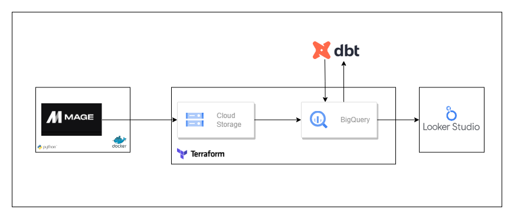

# femicide-data-project
2008-2023 Femicide in Turkey

# Turkey's Femicide Data Analysis Project (2008-2023)

## Project Overview
This repository hosts an analytical project focused on the analysis of femicide cases in Turkey from 2008 to 2023. The project aims to automate and streamline the data handling processes that were previously managed manually via Google Sheets. By automating these processes, we reduce human errors and enforce data quality checks through our pipeline and with the help of dbt. Regular reports that were once crafted manually on a monthly basis are now automatically generated, enhancing efficiency and consistency.

The project also seeks to automate the creation of dashboards and graphs, which are standardized and were previously visualized using data from Google Drive. With Looker Studio, we aim to update and visualize these elements more swiftly and automatically. The data used in this project is maintained by the "Kadın Cinayetlerini Durduracağız" platform, ensuring that the source is acknowledged and utilized responsibly.

## Future Note
Looking ahead, we plan to replace MageAI with Apache Airflow to further streamline our data orchestration, considering its robustness and production readiness. Additionally, future phases of the project will directly integrate with Google Drive and Sheets, enabling seamless data connectivity and accessibility.

## Data Source
Data for this project is sourced from the "Kadın Cinayetlerini Durduracağız" platform. Due to constraints around data sharing, only a sample dataset is included in this repository. Full datasets are visualized and managed through protected Looker Studio dashboards.

## Data Processing and Pipeline

### Data Extraction
- **Source**: Data is manually stored on Google Drive with various file types and structures.
- **Tool**: MageAI is used for initial data extraction, handling diverse data columns and types due to changes over the years.

### Data Transformation
- **Standardization**: Includes the normalization of Turkish characters and formatting adjustments.
- **Cleaning**: Processes involve null value handling and quality assurance measures.
- **Conversion**: Data is directly read and processed from Google Sheets, bypassing the need for intermediate file format conversions. Under the transformation folder, you can find two different scripts, mapping.py and transformer.py. Mapping is just for MageAI usage to obtain end-to-end pipeline; the other one provides more extended and unique transformations throughout the data.

### Data Storage and Backup
- **Cloud Storage**: Transformed data is stored in Google Cloud Storage, with regular backups to ensure data integrity and availability.
- **Monthly Updates**: In the next phase, the pipeline will be set up to update the cloud storage data sets on a monthly basis.

### Database and Dashboard Integration
- **BigQuery**: Used for data storage and complex querying tasks.
- **dbt (data build tool)**: Facilitates data transformation, testing, and deployment within managed cloud environments.
- **Looker Studio**: Employs the final transformed data for visualization purposes, generating insightful dashboards and reports.

## Tools and Technologies
- **[MageAI](https://mage.ai/docs)**: For data extraction and preparation. Planned to be replaced by **[Apache Airflow](https://airflow.apache.org/)** in future iterations for enhanced data orchestration.
- **[Google Cloud Storage](https://cloud.google.com/storage)** and **[BigQuery](https://cloud.google.com/bigquery/docs)**: For data storage and querying.
- **[dbt](https://docs.getdbt.com/)**: For data transformation and testing.
- **[Looker Studio](https://support.google.com/lookerstudio)**: For creating visualizations and dashboards.
- **[Terraform](https://www.terraform.io/docs)**: For managing cloud resources.
- **GitHub**: For source code management and version control.

## Workflow Diagram
A detailed workflow diagram illustrating the complete data flow and processing pipeline is available in the `workflow_diagram.png` file in this repository. This diagram is crucial for understanding how different components interact throughout the project.

## Contributions and Usage
Contributions are welcome! Feel free to fork this repository, propose changes via pull requests, or submit issues for bugs or enhancements. Please adhere to the project's code and data processing standards.

## License
This project is licensed under a standard open-source license, which provides freedoms to use, modify, and distribute under certain conditions. The full license text can be found in the LICENSE file in this repository.

## Note
We handle data with utmost respect for the sensitivity of the subject matter, aiming to make a positive societal impact on the issue of femicide in Turkey.

